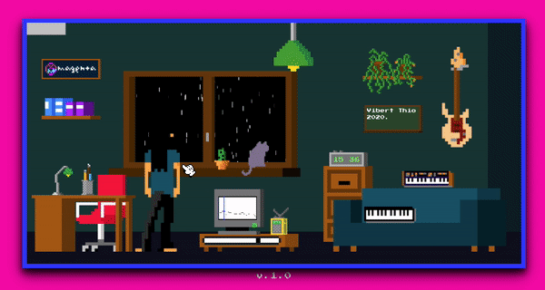

Based on the original Magenta Lo-fi player, but with (many) added functionalities.
Changes include; more instruments, pitch, detune, 3D environment, more drum sounds.
Also possible now is when the project runs you can create custom music for melodies/chords/bass/drums.

To start the project you have to have NODE.JS on your computer. Typ node SIMPLESERVER.JS in commmand prompt (Windows) to launch the project on port 9077. Enjoy! 

--------------------------------------------------------------------------------------------------------------------------------------------------------------------
The might fine original project can be accessed here: https://github.com/magenta/lofi-player
Info about version 1.3 (original project):

# Lo-Fi Player

Welcome to our “Lo-Fi Player” room! By interacting with elements in the room, you can build your own custom music stream. Or if you prefer, just relax, listen, and enjoy the view from the window. The experience is powered by machine learning models from [magenta.js](https://github.com/magenta/magenta-js).

For many it’s more fun to play around with the room without an instruction guide, so you might [try yourself](https://magenta.github.io/lofi-player/) before reading further (or watch it on [YouTube stream](https://magenta.github.io/lofi-player/stream)). Just click on the image above and Lo-Fi Player will start in a different browser tab. One hint: once the music starts, the green ceiling lamp can be used to stop it. Please read the [blog](https://magenta.tensorflow.org/lofi-player) if you want to know more about the project.

## Contributors
[Vibert Thio](https://vibertthio.com/portfolio/) is a Summer 2020 Magenta intern working with researcher Douglas Eck. Thanks to the beautiful people in Magenta for helping me make this project happen, including Fjord Hawthorne, Andy Coenen, Monica Dinculescu and others. Thanks also to Damien Henry from Google Arts and Culture and to Amit Pitaru and others from Google Creative Lab New York. Thanks to Conehead and E V E for the counsel on music.

## Todos
- [ ] add service worker

**This is not an officially supported Google product**
